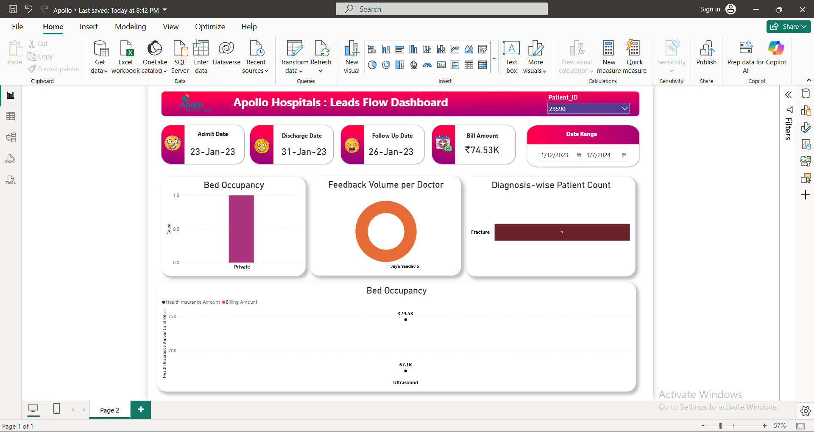

# 🏥 Apollo Hospitals: Leads Flow Dashboard (Power BI)

This repository contains a **Power BI dashboard** developed to monitor and analyze **Apollo Hospitals' patient leads flow**, including admissions, discharges, billing, feedback, and diagnosis metrics.  
The dashboard enables hospital administrators and analysts to gain **data-driven insights** into patient management and operational performance.

---

## 🚀 Features

- **Patient Tracking:** View and analyze patient admit, discharge, and follow-up dates.  
- **Billing Overview:** Displays total bill amount and insurance coverage comparisons.  
- **Bed Occupancy Insights:** Breakdown of occupancy types (Private, General, etc.).  
- **Doctor Feedback Summary:** Tracks patient feedback volume per doctor.  
- **Diagnosis Analysis:** Visualizes patient counts categorized by diagnosis type.  
- **Date Range Filter:** Dynamic date slicer for customized reporting periods.  
- **Patient Lookup:** Filter insights by unique **Patient ID** for detailed case review.

---

## 📊 Key Metrics

| Metric | Description |
|--------|--------------|
| 🏥 **Patient Leads Analyzed** | Individual patient record tracking |
| 💰 **Bill Amount** | ₹74.53K (example record shown) |
| 🛏️ **Bed Occupancy** | Private ward utilization rate |
| 👩‍⚕️ **Doctor Feedback** | Volume and satisfaction metrics |
| 🧾 **Health Insurance Comparison** | Billing vs. Insurance coverage trends |

---

## 🧠 Insights Highlight

- **Billing vs. Insurance:** Helps identify gaps between billed and insured amounts.  
- **Bed Utilization Patterns:** Highlights the most used ward types (e.g., Private).  
- **Diagnosis Trends:** Pinpoints common health issues such as fractures and their frequency.  
- **Feedback Analytics:** Monitors doctor-wise feedback volumes for service improvement.  

---

## 🛠️ Tools & Technologies

- **Microsoft Power BI**
- **Excel / SQL Server** — as data sources  
- **Data Modeling (DAX & Power Query)**
- **Custom Visualization & Theme Design**

---

## 📸 Dashboard Preview



---

## 📂 Repository Structure

```
├── Screenshot.png              # Dashboard preview
├── Apollo_Hospitals_Leads.pbix # Power BI file (if included)
└── README.md                   # Project documentation
```

---

## 💡 How to Use

1. Clone this repository:
   ```bash
   git clone https://github.com/<your-username>/apollo-hospitals-leads-dashboard.git
   ```
2. Open the `.pbix` file in **Power BI Desktop**.  
3. Connect to your hospital dataset or update data sources.  
4. Use filters (Patient ID, Date Range) to explore patient-level insights.  
5. Export visuals or reports for decision-making.

---

## 🧾 Author

**Created by:** [Your Name]  
📧 **Contact:** [your.email@example.com]  
🔗 **LinkedIn:** [Your LinkedIn Profile]  
